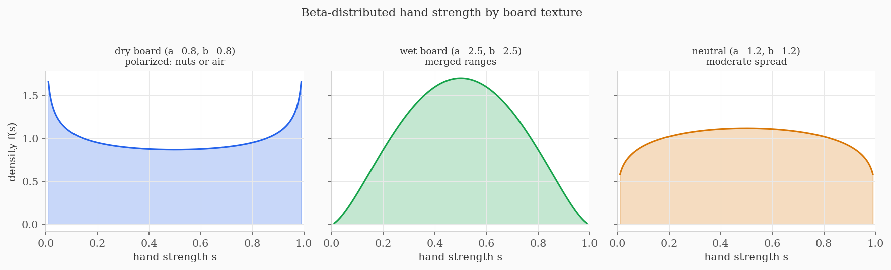
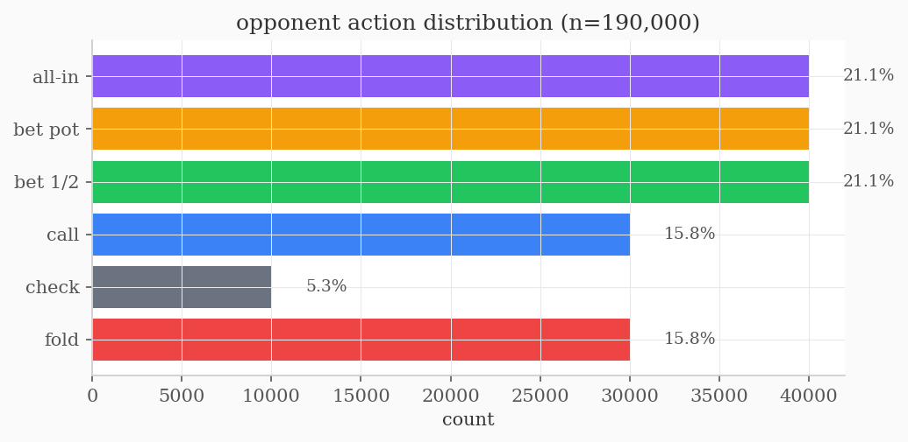

# gto-poker-solver

CFR+ solver for No-Limit Hold'em river endgames. Computes approximate Nash equilibrium strategies via self-play, detects exploitable opponents using the Minimum Defence Frequency criterion, and optionally poisons bot tracking models with deliberate folds.


## what it does

The solver models the river (final betting round) as a two-player zero-sum extensive-form game with imperfect information. It runs CFR+ to find strategies that converge to Nash equilibrium, then checks if the opponent folds too much and punishes that.

Three layers:

- **CFR+ self-play** -- accumulates counterfactual regret, averages strategy over time. Converges to Nash. Based on [Tammelin 2014](https://arxiv.org/abs/1407.5042).
- **MDF exploit detection** -- if the opponent's fold rate exceeds `pot / (pot + bet)`, the solver shifts weak hands to all-in. This is the mathematically correct best response.
- **Human-fold signal** -- intentionally folds a strong hand to corrupt a bot's fold-frequency tracker. The bot thinks you fold too much, starts over-bluffing, and you trap it. Fires stochastically (15%) and only on hands with real equity (strength >= 0.65).

## results

After 10k iterations on a dry board (pot=100, stack=200):

| metric | value |
|:---|---:|
| info sets discovered | 80 |
| final exploitability bound | 7.86 |
| opponent fold rate | 15.8% |
| classification | BALANCED |

Exploitability is still decreasing at 10k. More iterations = tighter bound.

### convergence


Left: mean regret normalized by T. Right: exploitability upper bound trending toward zero. Both behave as expected from the CFR convergence proof.

### equilibrium strategy


Weak hands (HS0-HS1) fold or bluff-shove. Strong hands (HS8-HS9) bet big. Middle hands check and call. This is the standard polarized strategy that game theory predicts for dry boards.

### hand strength model



Hand strength is abstracted to s in [0,1] drawn from Beta(a,b). Dry boards get a U-shaped distribution (polarized ranges), wet boards get a bell curve (merged ranges). This captures the right strategic dynamics without enumerating all 1326 starting hands.

### opponent actions



## usage

```bash
git clone https://github.com/uzumakix/gto-poker-solver.git
cd gto-poker-solver
pip install -r requirements.txt
python -m gto_poker_solver.main
```

Options:
```bash
python -m gto_poker_solver.main \
    --iterations 50000 \
    --pot 150 --stack 300 \
    --board WET \
    --mdf 0.55 \
    --human-fold
```

Run `python -m gto_poker_solver.main --help` for all flags.

## tests

```bash
pip install pytest
python -m pytest tests/ -v
```

31 tests covering zero-sum payoff invariants, regret matching correctness, Beta distribution shapes, exploit detection, and the human-fold signal.

## project structure

```
gto_poker_solver/
    poker_env.py      # game states, actions, Beta hand model, payoffs
    cfr_solver.py     # CFR+ engine, opponent model, exploit logic
    visualisation.py  # dashboard renderer
tests/
    test_env.py       # payoff + environment tests
    test_solver.py    # regret matching + training + exploit tests
```

## how CFR works (short version)

At each decision point, track how much you regret not taking each action. Actions you regret not taking get higher probability next round. Over time, the average strategy converges to Nash equilibrium.

The key equation is regret matching:

```
strategy(action) = max(regret(action), 0) / sum(max(regret(b), 0) for b in actions)
```

If all regrets are negative or zero, play uniform random. CFR+ (this implementation) floors negative regrets to zero each iteration, which speeds up convergence.

For the full math, see [Neller & Lanctot 2013](http://modelai.gettysburg.edu/2013/cfr/cfr.pdf) or [Zinkevich et al. 2007](https://papers.nips.cc/paper/2007/hash/08d98638c6fcd194a4b1e6992063e944-Abstract.html).

## references

- Zinkevich et al. (2007). *Regret Minimization in Games with Incomplete Information*. NeurIPS.
- Tammelin (2014). *Solving Large Imperfect Information Games Using CFR+*. arXiv:1407.5042.
- Brown & Sandholm (2019). *Superhuman AI for Multiplayer Poker*. Science 365(6456).
- Neller & Lanctot (2013). *An Introduction to Counterfactual Regret Minimization*.

## license

MIT
