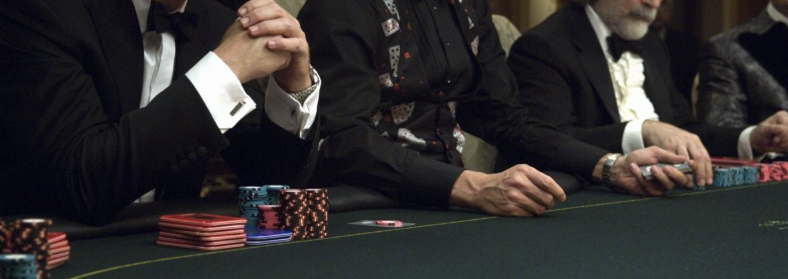
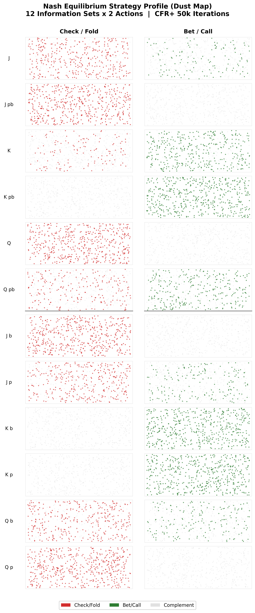
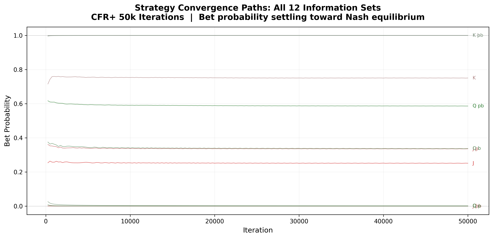

<p align="center">
  
</p>

## Project rationale

Two players play a simplified version of poker with just three cards. The code plays against itself millions of times, adjusting its strategy after each hand by tracking which decisions it regrets. After enough iterations, it converges to the strategy that cannot be exploited, no matter what the opponent does. That strategy is the Nash equilibrium, and for Kuhn poker it has a known closed-form solution, so the solver's output can be verified exactly.

# CFR+ Nash Equilibrium Solver for Kuhn Poker

A from-scratch implementation of **Counterfactual Regret Minimization (CFR+)** applied to Kuhn Poker (Kuhn 1950), a canonical benchmark in algorithmic game theory. The solver computes Nash equilibrium strategies through iterative self-play and regret matching, converging to the game-theoretic optimal strategy profile across all 12 information sets.

## What the project finds

The solver recovers a Nash equilibrium of Kuhn Poker after 50,000 CFR+ iterations. The full strategy profile across all 12 information sets:

**Player 0 (first to act):**

| Decision Point | Check/Fold | Bet/Call | Interpretation |
|----------------|-----------|----------|----------------|
| J at root | 0.749 | 0.251 | Bluff ~1/4 |
| Q at root | 0.999 | 0.001 | Never open |
| K at root | 0.250 | 0.750 | Value bet ~3/4 |
| J facing raise | 1.000 | 0.000 | Always fold |
| Q facing raise | 0.414 | 0.586 | Call ~3/5 |
| K facing raise | 0.000 | 1.000 | Always call |

**Player 1 (second to act):**

| Decision Point | Check/Fold | Bet/Call | Interpretation |
|----------------|-----------|----------|----------------|
| J facing bet | 1.000 | 0.000 | Always fold |
| Q facing bet | 0.662 | 0.338 | Call ~1/3 |
| K facing bet | 0.000 | 1.000 | Always call |
| J after check | 0.664 | 0.336 | Bluff ~1/3 |
| Q after check | 1.000 | 0.000 | Always check |
| K after check | 0.000 | 1.000 | Always bet |

The game value converges to **-1/18 = -0.0556**, matching the known analytical result (Kuhn 1950). Exploitability drops below 0.001, confirming convergence.

Kuhn Poker admits a family of Nash equilibria parameterized by a bluffing frequency alpha in [0, 1/3]. Player 0's strategy depends on alpha (J bluffs with probability alpha, K bets with probability 3 * alpha), while player 1's response adjusts accordingly. The solver converges to one member of this family with alpha near 0.25. All equilibria share the same game value of -1/18 for the first player.

## Game tree abstraction

Kuhn Poker is a minimal imperfect-information game with a tractable game tree. The full tree has **30 terminal histories** (6 card deals x 5 action sequences) and **12 information sets** (6 per player). Each information set groups decision nodes where the player holds the same card and faces the same action history, but cannot distinguish the opponent's card.

This small scale allows the CFR+ solver to traverse the complete game tree on every iteration without any lossy abstraction. No action bucketing, card bucketing, or Monte Carlo sampling is needed. The solver computes exact counterfactual values at every node. This makes Kuhn Poker an ideal benchmark for verifying that the CFR+ implementation converges correctly before scaling to larger games (Leduc, Rhode Island) where abstraction becomes necessary.

### Convergence

The convergence plot below is the primary mathematical proof that the algorithm approaches Nash equilibrium. Exploitability (y-axis, log scale) measures the maximum gain either player can achieve by deviating from the computed strategy. At Nash, exploitability is zero. After 50,000 iterations, exploitability drops below 0.001, confirming convergence to within numerical precision.


<p align="center">
  
</p>

### Strategy Profile

<p align="center">
  
</p>

### Nash Strategy Dust Map

Each cell below is filled with 500 scatter points (s=0.5, alpha=0.5) colored by the equilibrium mixing frequency. Red encodes Check/Fold probability; green encodes Bet/Call probability. Pure strategies appear as solid-color cells. Mixed strategies show a proportional split.

<p align="center">
  
</p>

### Per-Info-Set Convergence Paths

The plot below tracks the bet probability for all 12 information sets across 50,000 iterations. Each thin line (linewidth=0.5, alpha=0.6) represents one info set. Strategies fluctuate early, then settle into their Nash equilibrium values. Pure-strategy info sets (K b, K p, J b, J pb) converge immediately. Mixed-strategy info sets (J root, Q pb, Q b) take longer to stabilize.

<p align="center">
  
</p>

## How it works

**1. Game definition (`kuhn.py`)**
Kuhn Poker uses three cards (J, Q, K) dealt one to each of two players. Each player antes 1 chip, then they alternate between pass (check/fold) and bet (bet/call). The game tree has 5 terminal histories: pp, bp, bb, pbp, pbb. With 3 cards dealt to 2 players, there are 6 possible deals per iteration.

**2. CFR+ engine (`cfr.py`)**
The solver traverses the full game tree for all 6 card permutations each iteration. At every information set, it performs regret matching to derive the current iteration's strategy, then updates cumulative counterfactual regrets. CFR+ floors negative regrets to zero (Tammelin 2014), which accelerates convergence compared to vanilla CFR. The time-averaged strategy across all iterations converges to a Nash equilibrium.

**3. Convergence verification**
Exploitability is computed via information-set-level best response enumeration. For each player, we enumerate all pure strategies over their info sets and pick the one that maximizes (P0) or minimizes (P1) the expected value against the opponent's average strategy. At Nash, no player can unilaterally improve, so exploitability equals zero.

## Project structure

```
gto-poker-solver/
    kuhn.py              # game rules, terminal payoffs, info set keys
    cfr.py               # CFR+ solver, regret matching, exploitability
    solve.py             # training loop, plot generation
    requirements.txt     # numpy, matplotlib, seaborn
    results/
        convergence.png        # log-scale exploitability vs iterations
        strategy_heatmap.png   # Nash strategy profile per info set
        strategy_matrix.png    # dust-style equilibrium strategy map
        convergence_paths.png  # per-info-set convergence paths
        poker_banner.png       # header image
```

## Running

```bash
pip install -r requirements.txt
python solve.py
```

Results are saved to `results/`.

## References

1. Zinkevich, M., Johanson, M., Bowling, M., & Piccione, C. (2007). "Regret Minimization in Games with Incomplete Information." *Advances in Neural Information Processing Systems (NeurIPS)*.

2. Tammelin, O. (2014). "Solving Large Imperfect Information Games Using CFR+." *arXiv:1407.5042*.

3. Kuhn, H. W. (1950). "Simplified Two-Person Poker." *Contributions to the Theory of Games*, 1, 97-103.

4. Neller, T. W. & Lanctot, M. (2013). "An Introduction to Counterfactual Regret Minimization." *Teaching companion document*.

## License

MIT License. See [LICENSE](LICENSE).
