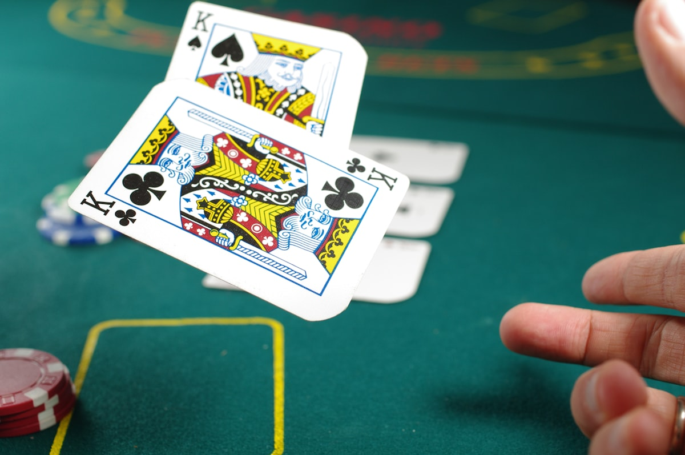

<p align="center">
  
</p>

# CFR+ Nash Equilibrium Solver for Imperfect Information Games

A from-scratch implementation of **Counterfactual Regret Minimization (CFR+)** applied to Kuhn Poker, a canonical benchmark in algorithmic game theory. The solver computes Nash equilibrium strategies through iterative self-play and regret matching, converging to game-theoretic optimal play in a provably correct manner.

## What the project finds

The solver recovers a Nash equilibrium of Kuhn Poker after 50,000 CFR+ iterations. The full strategy profile across all 12 information sets:

**Player 0 (first to act):**

| Decision Point | Check/Fold | Bet/Call | Interpretation |
|----------------|-----------|----------|----------------|
| J at root | 0.749 | 0.251 | Bluff ~1/4 |
| Q at root | 0.999 | 0.001 | Never open |
| K at root | 0.250 | 0.750 | Value bet ~3/4 |
| J facing raise | 1.000 | 0.000 | Always fold |
| Q facing raise | 0.414 | 0.586 | Call ~3/5 |
| K facing raise | 0.000 | 1.000 | Always call |

**Player 1 (second to act):**

| Decision Point | Check/Fold | Bet/Call | Interpretation |
|----------------|-----------|----------|----------------|
| J facing bet | 1.000 | 0.000 | Always fold |
| Q facing bet | 0.662 | 0.338 | Call ~1/3 |
| K facing bet | 0.000 | 1.000 | Always call |
| J after check | 0.664 | 0.336 | Bluff ~1/3 |
| Q after check | 1.000 | 0.000 | Always check |
| K after check | 0.000 | 1.000 | Always bet |

The game value converges to **-1/18 = -0.0556**, matching the known analytical result (Kuhn 1950). Exploitability drops below 0.001, confirming convergence.

Kuhn Poker admits a family of Nash equilibria parameterized by a bluffing frequency alpha in [0, 1/3]. Player 0's strategy depends on alpha (J bluffs with probability alpha, K bets with probability 3 * alpha), while player 1's response adjusts accordingly. The solver converges to one member of this family with alpha near 0.25. All equilibria share the same game value of -1/18 for the first player.

### Convergence

<p align="center">
  
</p>

### Strategy Profile

<p align="center">
  
</p>

## How it works

**1. Game definition (`kuhn.py`)**
Kuhn Poker uses three cards (J, Q, K) dealt one to each of two players. Each player antes 1 chip, then they alternate between pass (check/fold) and bet (bet/call). The game tree has 5 terminal histories: pp, bp, bb, pbp, pbb. With 3 cards dealt to 2 players, there are 6 possible deals per iteration.

**2. CFR+ engine (`cfr.py`)**
The solver traverses the full game tree for all 6 card permutations each iteration. At every information set, it performs regret matching to derive the current iteration's strategy, then updates cumulative counterfactual regrets. CFR+ floors negative regrets to zero (Tammelin 2014), which accelerates convergence compared to vanilla CFR. The time-averaged strategy across all iterations converges to a Nash equilibrium.

**3. Convergence verification**
Exploitability is computed via information-set-level best response enumeration. For each player, we enumerate all pure strategies over their info sets and pick the one that maximizes (P0) or minimizes (P1) the expected value against the opponent's average strategy. At Nash, no player can unilaterally improve, so exploitability equals zero.

## Project structure

```
gto-poker-solver/
    kuhn.py              # game rules, terminal payoffs, info set keys
    cfr.py               # CFR+ solver, regret matching, exploitability
    solve.py             # training loop, plot generation
    requirements.txt     # numpy, matplotlib, seaborn
    results/
        convergence.png       # log-scale exploitability vs iterations
        strategy_heatmap.png  # Nash strategy profile per info set
        poker_banner.jpg      # header image
```

## Running

```bash
pip install -r requirements.txt
python solve.py
```

Results are saved to `results/`.

## References

1. Zinkevich, M., Johanson, M., Bowling, M., & Piccione, C. (2007). "Regret Minimization in Games with Incomplete Information." *Advances in Neural Information Processing Systems (NeurIPS)*.

2. Tammelin, O. (2014). "Solving Large Imperfect Information Games Using CFR+." *arXiv:1407.5042*.

3. Kuhn, H. W. (1950). "Simplified Two-Person Poker." *Contributions to the Theory of Games*, 1, 97-103.

4. Neller, T. W. & Lanctot, M. (2013). "An Introduction to Counterfactual Regret Minimization." *Teaching companion document*.

## License

MIT License. See [LICENSE](LICENSE).
