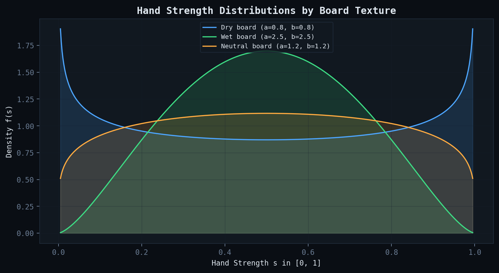
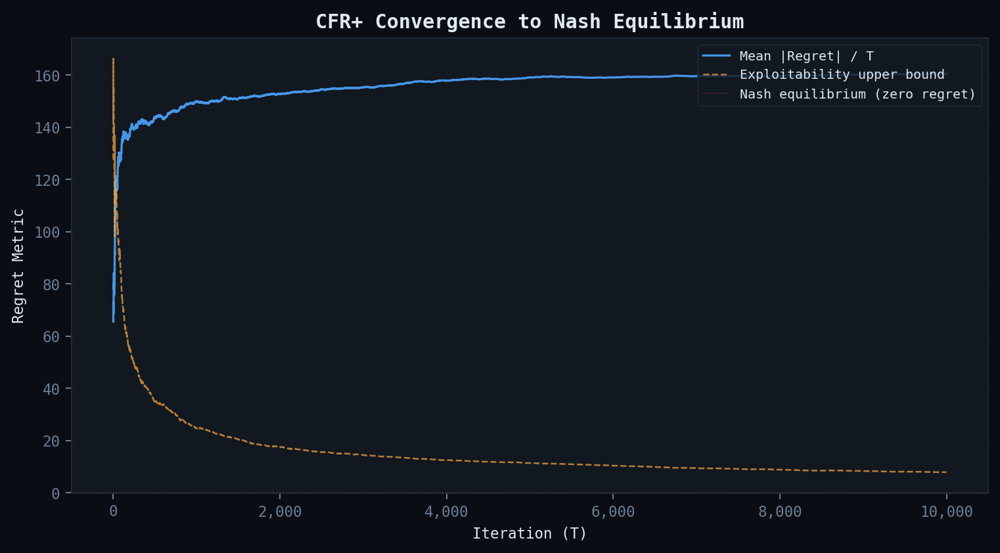
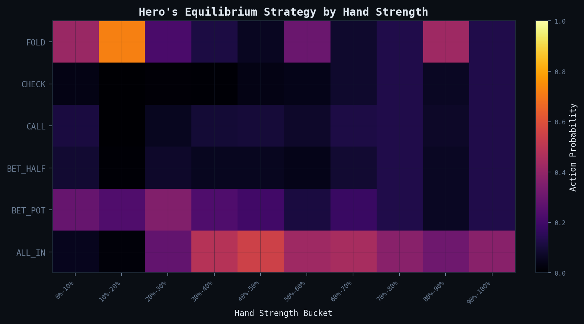
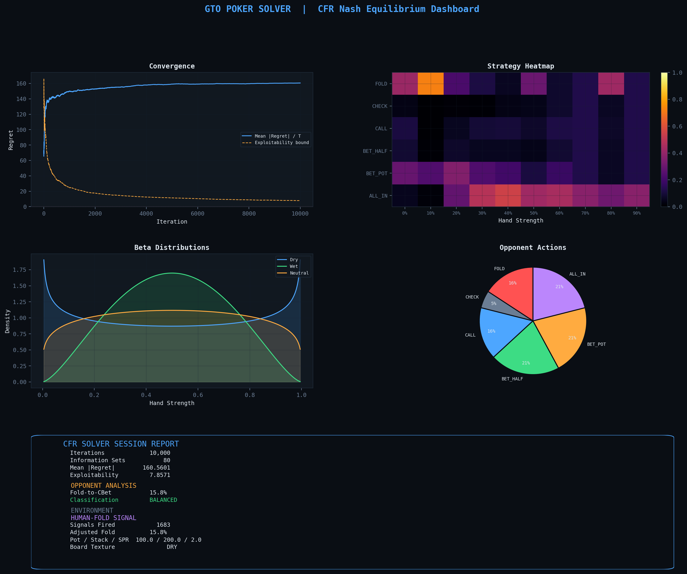

# GTO Poker Solver

**Computing Nash equilibrium strategies for No-Limit Hold'em river endgames using Counterfactual Regret Minimization.**

<div align="center">


</div>

---

## Why this project?

Poker is one of the cleanest real-world examples of **imperfect-information game theory**. Two players, hidden cards, and a pot. The question is simple: can you find a strategy that no opponent can exploit?

That question is the Nash equilibrium problem. And the algorithm that solves it for extensive-form games is **Counterfactual Regret Minimization (CFR)**.

I built this solver because I wanted to understand CFR from scratch, not just read about it. The river endgame (the final betting round in Hold'em) is the right scope: complex enough to be interesting, small enough to actually converge. It sits at the intersection of **applied mathematics, multi-agent decision-making, and optimization** -- exactly the kind of problem I want to work on in grad school.

This project connects to the core math behind traffic flow equilibria, multi-agent coordination, and competitive resource allocation. These are the same structures that show up in civil infrastructure modeling, network optimization, and mechanism design.

---

## What the solver actually does

Three layers of computation:

| Layer | Method | What it does |
|:---|:---|:---|
| **Equilibrium** | CFR+ self-play | Finds approximate Nash equilibrium strategies |
| **Exploitation** | MDF criterion | Detects and punishes opponents who fold too much |
| **Meta-game** | Human-fold signal | Poisons a bot's tracking model with deliberate folds |

---

## The math

### CFR: how it works

The solver models the river as a two-player zero-sum game tree. Each player's decision points are grouped into **information sets** (you can't tell which exact hand your opponent has, only which bucket they're in).

For each information set, we track the **counterfactual regret** of every action:

$$r^t(I, a) = v_i^{\sigma^t}(I \!\to\! a) - v_i^{\sigma^t}(I)$$

This measures: "how much better would action $a$ have been compared to what I actually played?"

We accumulate regret over $T$ iterations:

$$R^T(I, a) = \sum_{t=1}^{T} r^t(I, a)$$

And the strategy at each step comes from **regret matching**:

$$\sigma^{t+1}(I, a) = \begin{cases}
\dfrac{R^t(I, a)^{+}}{\sum_{b} R^t(I, b)^{+}} & \text{if } \sum_{b} R^t(I, b)^{+} > 0 \\[8pt]
\dfrac{1}{|A(I)|} & \text{otherwise}
\end{cases}$$

The key result: the **time-averaged strategy converges to Nash equilibrium**, with exploitability bounded by:

$$\epsilon \leq \frac{1}{T}\sum_{I \in \mathcal{I}_i} \max_a R^T(I, a)^{+} \xrightarrow{T \to \infty} 0$$

This implementation uses **CFR+** (Tammelin, 2014), which floors negative regrets to zero each iteration. It converges faster because old mistakes don't drag down strategies that turn out to be good later.

### Hand strength model

Instead of enumerating all 1,326 Hold'em starting hands, I abstract hand strength to $s \in [0, 1]$ drawn from a **Beta distribution** parameterized by board texture:

$$s \sim \text{Beta}(\alpha, \beta)$$

| Board | $\alpha$ | $\beta$ | Shape | What it means |
|:---:|:---:|:---:|:---|:---|
| Dry | 0.80 | 0.80 | U-shaped | Polarized: hands are strong or weak, rarely medium |
| Wet | 2.50 | 2.50 | Bell | Merged: most hands are medium strength |
| Neutral | 1.20 | 1.20 | Flat-ish | Mix of everything |

<p align="center">
  
</p>

This is a clean abstraction. The U-shape on dry boards captures the "nuts or air" polarization that poker players talk about. The bell shape on wet boards captures the merged, connected ranges.

### Minimum Defence Frequency (MDF)

If someone bets $b$ into a pot of $p$, you need to continue with at least:

$$\text{MDF} = \frac{p}{p + b}$$

of your range to prevent the bet from being automatically profitable. The solver tracks the opponent's fold rate and, when it exceeds this threshold, overrides the bottom 20% of Hero's range to pure all-in. This is the mathematically correct best response.

### The human-fold signal

This is the part I find most interesting. Bots build opponent models by counting your folds. They assume every fold is genuine. But what if you fold a strong hand on purpose?

The bot records it as a real fold. Its model now thinks you fold too much. It starts bluffing more. And then you trap it.

The signal fires when three conditions hold:
- Hand strength >= 0.65 (you're actually sacrificing real equity)
- EV sacrifice is capped (bounded loss on the signal hand)
- Random activation at 15% (so it's not predictable)

The math is simple: this is profitable when the future value of the corrupted opponent model exceeds the EV you gave up.

$$\sum_{t=\tau+1}^{T} \Delta\text{EV}_t^{\text{trap}} > \text{EV}_\tau^{\text{sacrificed}}$$

---

## Results

### Convergence

The solver converges to Nash equilibrium. Mean regret and the exploitability upper bound both decrease toward zero over 10,000 iterations.

<p align="center">
  
</p>

### Strategy heatmap

This is what the equilibrium strategy looks like across hand-strength buckets. Strong hands bet big or shove. Weak hands fold or bluff-shove. Medium hands play passively. Exactly what game theory predicts.

<p align="center">
  
</p>

### Full dashboard

<p align="center">
  
</p>

---

## Project structure

```
gto-poker-solver/
├── gto_poker_solver/
│   ├── __init__.py          # public API
│   ├── poker_env.py         # game environment, hand model, payoffs
│   ├── cfr_solver.py        # CFR+ engine, opponent model, exploit logic
│   └── visualisation.py     # dark-theme dashboard renderer
├── tests/
│   ├── conftest.py          # shared fixtures
│   ├── test_env.py          # zero-sum payoff, legal actions, hand model
│   └── test_solver.py       # regret matching, training, exploitation
├── results/                 # generated plots
├── main.py                  # CLI entry point
├── pyproject.toml           # packaging config
└── requirements.txt
```

---

## Quick start

```bash
git clone https://github.com/uzumakix/gto-poker-solver.git
cd gto-poker-solver
pip install -r requirements.txt
python -m gto_poker_solver.main
```

### CLI options

```bash
python -m gto_poker_solver.main \
    --iterations 50000 \
    --pot 150 \
    --stack 300 \
    --board WET \
    --mdf 0.55 \
    --human-fold \
    --output results.png
```

| Flag | Default | Description |
|:---|:---:|:---|
| `-n`, `--iterations` | 10,000 | CFR self-play iterations |
| `--pot` | 100 | Starting pot |
| `--stack` | 200 | Effective stack |
| `--board` | DRY | Board texture: `DRY`, `WET`, `NEUTRAL` |
| `--mdf` | 0.50 | MDF threshold for exploit detection |
| `--seed` | 42 | RNG seed |
| `--human-fold` | off | Enable the deliberate-fold signal |
| `-o`, `--output` | `cfr_dashboard.png` | Dashboard output path |
| `--json-report` | none | JSON session report |

---

## Testing

```bash
python -m pytest tests/ -v
```

Tests cover:
- Zero-sum invariant at every terminal node
- Fold payoff is exactly pot/2 (not full pot)
- Beta distribution shapes match board textures
- Regret matching produces uniform strategy under zero regret
- Human-fold signal respects strength floor and sacrifice cap
- Exploit criterion reads opponent fold rate, not Hero's

---

## References

1. Zinkevich, M. et al. (2007). *Regret Minimization in Games with Incomplete Information*. NeurIPS.
2. Tammelin, O. (2014). *Solving Large Imperfect Information Games Using CFR+*. arXiv:1407.5042.
3. Brown, N. & Sandholm, T. (2019). *Superhuman AI for Multiplayer Poker*. Science, 365(6456).
4. Neller, T. W. & Lanctot, M. (2013). *An Introduction to Counterfactual Regret Minimization*.

---

MIT License
